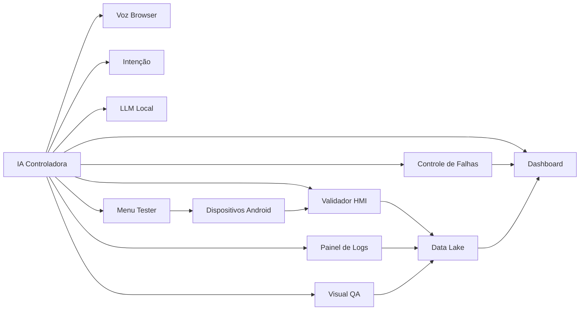

# Arquitetura VWAIT

Esta e a estrutura alvo consolidada do projeto apos a reestruturacao.

## Estrutura principal

```text
vwait/
  src/
    vwait/
      core/
      platform/
      features/
      entrypoints/
  scripts/
  tests/
    unit/
    integration/
    e2e/
  docs/
  requirements/
  tools/
  workspace/
```

## Responsabilidades

- `src/vwait/core`: configuracao, paths e recursos compartilhados de baixo acoplamento
- `src/vwait/platform`: integracoes tecnicas com SO, ADB e infraestrutura
- `src/vwait/features`: modulos de produto organizados por feature
- `src/vwait/entrypoints`: pontos de entrada oficiais CLI e Streamlit
- `scripts`: launchers operacionais para Linux e Windows
- `tests`: suites separadas por nivel
- `tools`: utilitarios de apoio e dependencias externas locais
- `workspace`: artefatos e relatorios gerados em runtime

## Features principais

- `chat`
- `tester`
- `execution`
- `logs`
- `failures`
- `hmi`
- `visual_qa`

## Mapa Neural IA

O mapa neural deve ser representado como um conjunto de agentes operacionais, não como uma lista de arquivos. Os agentes são as features e as responsabilidades do VWAIT em execução.

Agentes principais:

- `IA Controladora` (`chat`): roteia comandos, decide fluxos e orquestra os outros agentes.
- `Voz Browser` (`chat`): captura voz no navegador e entrega comandos para processamento.
- `Intenção` (`chat`): transforma linguagem natural em ações e rotas de serviço.
- `LLM Local` (`chat`): fornece fallback semântico, classificação e respostas contextuais.
- `Menu Tester` (`tester`): inicia e controla a execução de testes, coletas e loops de retorno.
- `Validador HMI` (`hmi`): compara capturas com a biblioteca GEI/Figma e gera resultados visuais.
- `Painel de Logs` (`logs`): monitora telemetria do rádio e disponibiliza informações para inspeção.
- `Controle de Falhas` (`failures`): triagem de falhas, evidências e preparação de encaminhamentos.
- `Dashboard` (`execution`): supervisão em tempo real de execuções e estado do sistema.
- `Visual QA` (`visual_qa`): pipeline de classificação visual, embeddings e validação de screenshots.
- `Data Lake` (`core` / `Data`): persistência de artefatos, capturas, relatórios e caches.
- `Dispositivos Android` (`platform`): ponte ADB, scrcpy/malagueta e monitoramento de touch.

### Como modelar no Obsidian

O gráfico do Obsidian mostra notas/arquivos, não o diagrama conceitual “por si só”. Na sua captura, o gráfico ainda mostra nomes de módulos como `zuri.kernel`, `tester.panel`, `adb.bridge`, `dashboard.live`, `failure.control` e `hmi.validator`. Isso significa que o vault está indexando os nomes do repositório ou notas de código em vez de um modelo de agentes.

Para transformar isso em uma visão de agentes, você precisa:

1. criar notas reais para cada agente;
2. nomear essas notas pelos agentes, não pelos arquivos ou pelo caminho do código;
3. ligar essas notas usando links internos `[[ ]]`;
4. ocultar ou excluir do gráfico as pastas de código do repositório.

#### Exemplo de estrutura de agente

- `Agents/IA Controladora`
- `Agents/Voz Browser`
- `Agents/Intenção`
- `Agents/LLM Local`
- `Agents/Menu Tester`
- `Agents/Validador HMI`
- `Agents/Painel de Logs`
- `Agents/Controle de Falhas`
- `Agents/Dashboard`
- `Agents/Visual QA`
- `Agents/Data Lake`
- `Agents/Dispositivos Android`

#### Exemplo de mapeamento dos nomes do gráfico atual para agentes

- `zuri.kernel` → `IA Controladora`
- `chat.ui` → `Voz Browser` / `Interface de Comando`
- `nav.router` → `Intenção` / `Roteador`
- `ollama.llm` → `LLM Local`
- `tester.panel` → `Menu Tester`
- `adb.bridge` → `Dispositivos Android`
- `hmi.validator` → `Validador HMI`
- `hmi.cache` → `Estado/Cache HMI`
- `dashboard.live` → `Dashboard`
- `failure.control` → `Controle de Falhas`
- `logs.panel` → `Painel de Logs`
- `report.builder` → `Relatórios`
- `dataset.pipe` → `Dataset`

Isso significa que, em vez de criar notas com `zuri.kernel` ou `chat.ui`, crie-as com os nomes dos agentes e conecte-as entre si.

#### O que cada nota de agente deve ter

- responsabilidade do agente
- entradas e saídas principais
- dependências com outros agentes
- estado esperado em runtime
- referência ao código relevante (`src/vwait/features/...` ou `src/vwait/platform/...`)
- tag como `#agent`

#### Por que você ainda vê arquivos

Se o Graph View incluir o diretório `src/`, ele vai mostrar as notas/arquivos do código, que não são o foco do seu modelo de agentes.

- o Obsidian vê nós como arquivos/notas
- `zuri.kernel` e `tester.panel` são nomes de módulos, não de agentes conceituais
- o gráfico só será realmente de agentes quando as notas de agente estiverem isoladas e conectadas

#### Como filtrar o gráfico para agentes

- use `path:Agents` ou `tag:#agent` no filtro local do Graph View;
- configure `Exclude files/folders` para ocultar `src/`, `tests/`, `docs/`, `workspace/` e outras pastas de código;
- se quiser, separe o mapa de agentes em um vault Obsidian dedicado à arquitetura.

#### Nota central de referência

Crie uma nota de referência única, por exemplo `Arquitetura/VWAIT - Agentes`, que contenha links para todos os agentes e um diagrama Mermaid central.

### Exemplo Mermaid de agentes



### O que muda da visão de arquivos

- o foco passa de onde o código está para o que cada componente faz em runtime;
- cada feature vira um agente com responsabilidades claras;
- o Obsidian vira um mapa de comportamento e dependências, não um índice de diretórios.

## Convencoes

- nova logica de produto deve nascer em `src/vwait/features/...`
- novos pontos de entrada devem nascer em `src/vwait/entrypoints/...`
- scripts operacionais devem ficar em `scripts/...`
- utilitarios operacionais e dependencias locais devem ir para `tools/...`
- dados de runtime devem ficar em `workspace/...` quando fizer sentido

## Compatibilidade restante

- `HMI/tessdata` permanece como recurso de OCR
